# readinglist

## Exploration
[VIME: Variational Information Maximizing Exploration{1605}](#vime):+1:

[Self-Supervised Exploration via Disagreement{1906}](#self-supervised-exploration-via-disagreement):fire::+1:

[Deep Exploration via Bootstrapped DQN{1602}](#bootstrapped-dqn)

[Unifying Count-Based Exploration and Intrinsic Motivation{1606}](#unifying-count-based-exploration):+1:

[#Exploration: A Study of Count-Based Exploration for Deep Reinforcement Learning{1611}](#hash-exploration)

[EX2: Exploration with Exemplar Models for Deep Reinforcement Learning{1703}](#ex2)

[Incentivizing Exploration In Reinforcement Learning With Deep Predictive Models{1507}](#incentivizing-exploration-with-deep-predictive-models)

[Count-Based Exploration with Neural Density Models{1703}](#count-based-exploration-with-pixelcnn)

[Exploration by Random Network Distillation{1810}](#rnd):fire::+1:

[Randomized Prior Functions for Deep Reinforcement Learning{1806}](#random-prior-functions)

[Large-Scale Study of Curiosity-Driven Learning{1808}](#large-scale-study-of-curiosity-driven-learning)

[Dynamic Bottleneck for Robust Self-Supervised Exploration{2110}](#dynamic-bottleneck):fire::+1:

[Curiosity-Bottleneck: Exploration By Distilling Task-Specific Novelty{ICML19}](#curiosity-bottleneck):fire:

[State Entropy Maximization with Random Encoders for Efficient Exploration{2102}](#re3-random-encoders-for-efficient-exploration):fire::+1:

[Visual Reinforcement Learning with Imagined Goals{1807}](#imagined-goals)

[Skew-Fit: State-Covering Self-Supervised Reinforcement Learning{1903}](#skew-fit)

[Dynamics Generalization via Information Bottleneck in Deep Reinforcement Learning{2008}](#dynamic-generalization-via-information-bottleneck)

### VIME

### [VIME: Variational Information Maximizing Exploration{1605}](https://arxiv.org/abs/1605.09674)

#### Main contribution and core idea

1. agent's goal of choosing an action: max the information gain. (max the reduction in uncertainty)
2. variational inference to approximate mutual information along trajs.
3. implementation: BNNs, parameters represetation trick.

#### Surprising, difficult and confusing part

surprising: model good to explain the goal is to max the reduction in uncertainty.

difficult: theoretical math with practical implementation

#### Experiments and baselines

Just so so. No strong baselines.

#### How to apply and anywhere

max the information gain(mutual information).

#### [blog](https://www.zhihu.com/search?type=content&amp;q=VIME) and [notes](https://github.com/youngzhou1999/readinglist/tree/main/README.assets/VIME.png)

[BACK TO LIST](#exploration)

### Self-Supervised Exploration via Disagreement
### [Self-Supervised Exploration via Disagreement{1906}](https://arxiv.org/abs/1906.04161)

#### Main contribution and core idea

self-supervised to learn skills without external reward, learning completely from scratch.

idea: minimize prediction error and maximize the prediction difference at the same time.

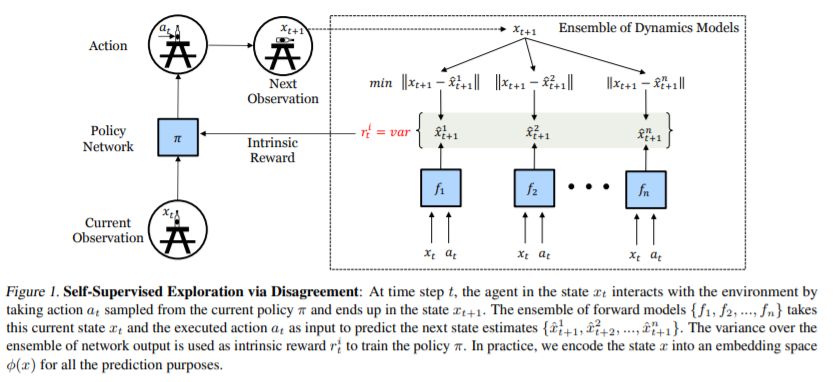

#### Surprising, difficult and confusing part

good writing, easy to read, simple yet efficient algo. 

#### Experiments and baselines

atari, minist, maze, mujuco and real robot: good performance.

baselines: pathak 2017,large scale study of curiosity-driven{all prediction error based} 

#### How to apply and anywhere

no/sparse reward envs.

**check the multi-step method**.

[BACK TO LIST](#exploration)

### Bootstrapped DQN
### [Deep Exploration via Bootstrapped DQN{1602}](https://arxiv.org/abs/1602.04621)

#### Main contribution and core idea

contribution: a simple yet efficient DQN algorithm with good ability to explore.

core idea: multi-head q. inspired by TS(random choose head).

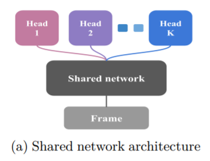

**Not tried to tract exact posterior and RANDOM initialization in drl.**

#### Surprising, difficult and confusing part

surprsing: use simple task to show the **distribution** of what learned, which is similar to the true posterior.

Their team  do exploration for a long time.(very persuasive and respect).

#### Experiments and baselines

atrai; DQN. exps are ok.

#### How to apply and anywhere

multi-head -> assemble model and disagreement.

how: **multi-step, pure-exploration.**

[BACK TO LIST](#exploration)

### Unifying Count-Based Exploration
### [Unifying Count-Based Exploration and Intrinsic Motivation{1606}](https://arxiv.org/abs/1606.01868)

#### Main contribution and core idea

contribution: unify pseudo-count in deep rl which is how to get hat{N(s)}, hat{n}. use model to build probability of counts.

core idea: use density model to produce density estimation and re-catch N(s), n. use pseudo-count to build a bonus.(normally N^{1/2} or N^{-1}). 

#### Surprising, difficult and confusing part

surprising: make drl countable by transfering algo in traditional/small MDP.(count by table).

diff: math derive in PG.(But it's ok now).

#### Experiments and baselines

atari, DQN, UCB.  good performance. using DQN with bonus can work well in montezuma's revenge(15 rooms in 50m steps).

#### How to apply and anywhere

how: with other algo(or modify detail of count-based).

anywhere: pseudo-count algos always use this def. like pixelcnn, #count, ex2.

**mark here(22/1/4): pseudo-count algos are not that good when compared to other algos nowadays.**

[BACK TO LIST](#exploration)

### Hash Exploration
### [#Exploration: A Study of Count-Based Exploration for Deep Reinforcement Learning{1611}](https://arxiv.org/abs/1611.04717)

#### Main contribution and core idea

contribution: A count-based algo which can be used in multi-domain.

core idea: use sim-hash to build state count.

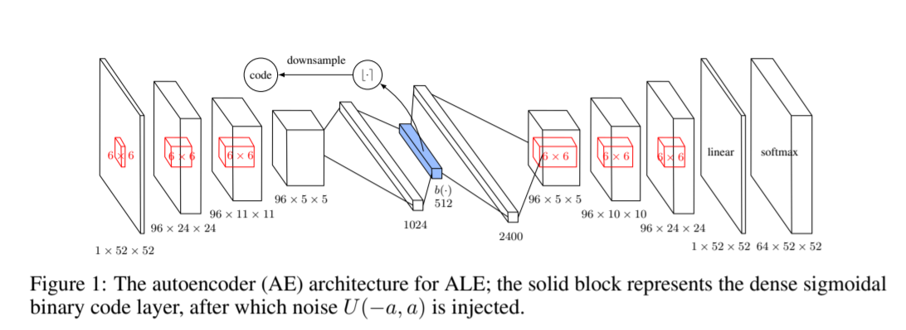

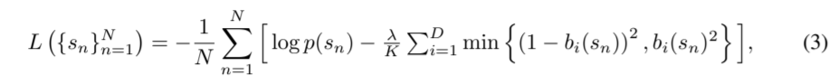

first part: maximize  the likelihood of output. second part: push b(s) into 0 or 1 to count better.  

#### Surprising, difficult and confusing part

surprising: use noise inject in sigmoid function(But didn't that popular in other place?).

#### Experiments and baselines

continuous: RLlab, VIME. 

ALE: (performance just so so), **using BASS future is well.**

conclusion: in continuous setting, it beats VIME. very good.

#### How to apply and anywhere

how: low dimension approximation(like vae).

[BACK TO LIST](#exploration)

 ### EX2

### [EX2: Exploration with Exemplar Models for Deep Reinforcement Learning{1703}](https://arxiv.org/abs/1703.01260)

#### Main contribution and core idea

contribution: 

1. based entirely on discriminative trained exemplar models. 

2. compare new state to past state.

3. no explicit density model.

core idea: 

discriminate new state from past states(no explicit density model to measure novelty).

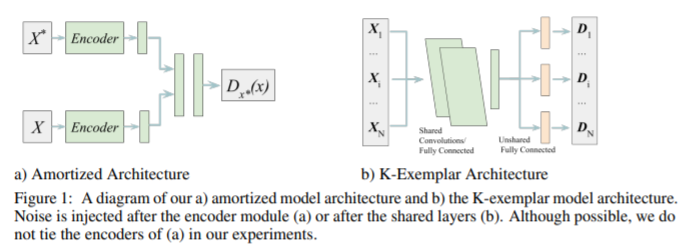

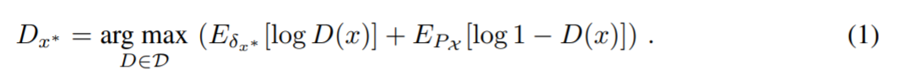

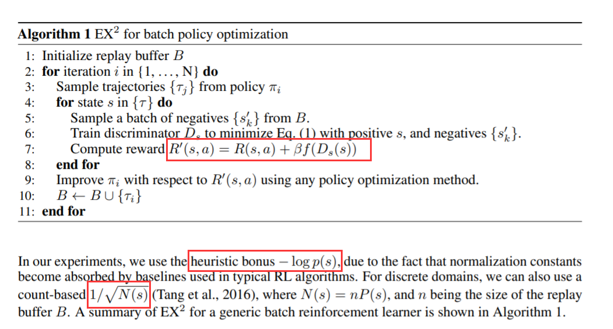

where D is a NN.

#### Surprising, difficult and confusing part

surprising: good math story and exps.

difficult: math derivative in eq(1) with implicit density estimation. 

#### Experiments and baselines

baselines: VIME, #exploration, TRPO

exps are good. beat VIME, similar with #.

#### How to apply and anywhere

the idea of new state/past states distinguish is good. but none otherwhere.

[BACK TO LIST](#exploration)

### Incentivizing Exploration With Deep Predictive Models

### [Incentivizing Exploration In Reinforcement Learning With Deep Predictive Models{1507}](https://arxiv.org/abs/1507.00814)

#### Main contribution and core idea

contribution: a learned system dynamics as forward model and using **prediction error** as bonus.

core idea: [notes](https://github.com/youngzhou1999/readinglist/tree/main/README.assets/incentivizing.png)

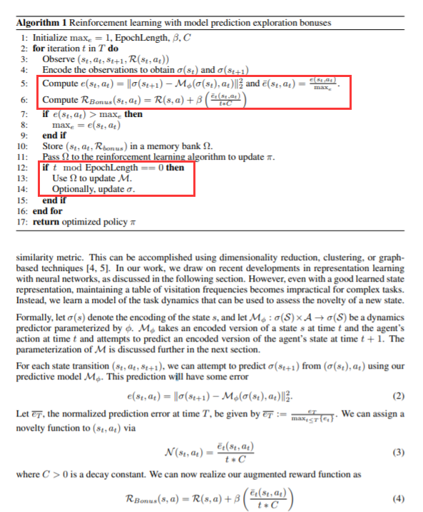

#### Surprising, difficult and confusing part

surprising: model M is rather simple as σ.

#### Experiments and baselines

DQN+bonus, atari(with static/dynamic AE).

baseline: DQN + other traditional bonus.

In atari, it's useful.

#### How to apply and anywhere

**prediction error bonus** with **model-based(learning) exploration** have many paper(simple, efficient).

[BACK TO LIST](#exploration)

### Count-based Exploration with PixelCNN

### [Count-Based Exploration with Neural Density Models{1703}](https://arxiv.org/abs/1703.01310)

#### Main contribution and core idea

contribution: use complicated density model and explain the role of monte carlo in exploration.

core idea: use PixelCNN as density model.

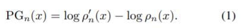

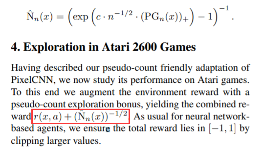

#### Surprising, difficult and confusing part

surprising: MMC is rather good.(monte-carlo in exloration as noise)

difficult: no source code.

confusing: how to deal with 4 channel  in atrai with pixelcnn(maybe on channel).

#### Experiments and baselines

atrai, dqn mc/no mc, dqn cts, reactor with retrace.

exps are good, but re-cons in minigrid is painful.

#### How to apply and anywhere

how: mmc or mc(long horizon) in exploration is good.

[BACK TO LIST](#exploration)

### RND

### [Exploration by Random Network Distillation{1810}](https://arxiv.org/abs/1810.12894)

#### Main contribution and core idea

contribution: a new way to explore by **prediction error**. montezuma's revenge beats human.

core idea: use a **random & fixed** network as target.

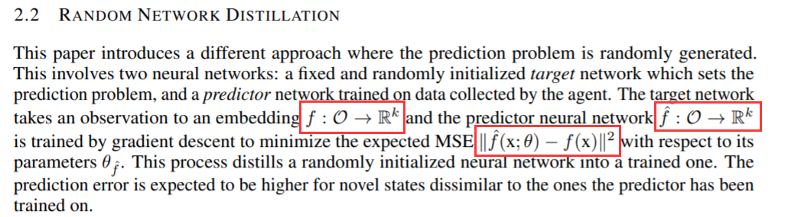

intuition: for a network f, the prediction error is higher when the input x is more different with the data it has seen before. 

#### Surprising, difficult and confusing part

surprising: conclude 4  reasons for high prediction error.

1. training data not enough.
2. stochastic objective function
3. wrong model
4. problem with optimization.

we encourage 1 and discourage 2,3,4.

training setting detail: 

1. non episodic in intrinsic training(constant information for exploration).
2. episodic for extrinsic training(as a ddl in case of agent stuck in the start).

confusing: actual frame is more than figure(maybe figure cut).

#### Experiments and baselines

PPO, RND, Dynamics(Hagan 2018).

ablation: 1. cnn, rnn 2. num of envs 3. episodic/non-episodic

conclusion: 

1. in no extrinsic reward setting, non-episode perform better.
2. in extrinsic rewarad setting, **reward comes from two head(extrinsic and intrinsic)**.

#### How to apply and anywhere

how: policy with random network to get a boarder distribution.

anywhere: lilichen's new paper and ngu.

#### [blog](https://zhuanlan.zhihu.com/p/146309991)

[BACK TO LIST](#exploration)

### Random Prior Functions

### [Randomized Prior Functions for Deep Reinforcement Learning{1806}](https://arxiv.org/abs/1806.03335)

#### Main contribution and core idea

contribution: 

1. improve bootstrapped q, analysis prior in rl.
2. design a random, untrained **prior** network.

core idea: 

prior + noise  -> ensemble diverse -> posterior(random) like TS.

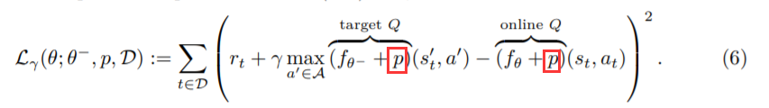

#### Surprising, difficult and confusing part

easy to read.

#### Experiments and baselines

baselines: epsilon-greedy, bootstrapped(bs), BSR(bs + L2), BSP(bs + prior)

exps:

1. scale up
2. carpole, swing-up

3. MR: BSP 2000+(good for dqn based)

#### How to apply and anywhere

how: prior regularize. (maybe) for any objetcive function in rl, we can add a **random, fixed and untrained network to encourage exploration**.

anywhere:  RND

[BACK TO LIST](#exploration)

### Large-Scale Study of Curiosity-Driven Learning

### [Large-Scale Study of Curiosity-Driven Learning{1808}](https://arxiv.org/abs/1808.04355)

#### Main contribution and core idea

contribution: 

1. explore the good/limits of curiosity based exploration(prediction error).
2. discuss the φ(x) and its performance in origin/generation setting.

core idea:

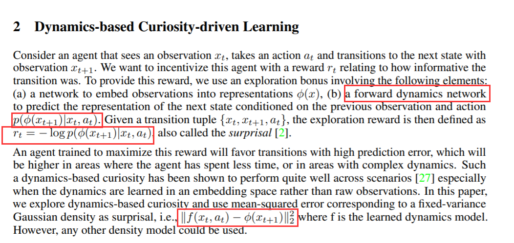

#### Surprising, difficult and confusing parts

surprising: 

1. pre-trained VAE: biased to where the agent started.
2. normalization: advantage, obs, reward
3. **inf horizon**

#### Experiments and baselines

may aspects:

1. embedding: origin random good. generation: learned good.
2. parallel env 128, very useful.
3. noisy-tv is the limit of curiosity based.

#### How to apply and anywhere

pure exploration, inf horizon setting.

anywhere: RND(although they are in the same period).

#### [blog](https://zhuanlan.zhihu.com/p/84998411)(rather good)

[BACK TO LIST](#exploration)

### Dynamic Bottleneck

### [Dynamic Bottleneck for Robust Self-Supervised Exploration{2110}](https://arxiv.org/abs/2110.10735)

#### Main contribution and core idea

contribution: 

1. handle dynamic-irrelevant information target robust policy(handle noisy env).
2. build intrinsic reward for self-supervised exploration.

core idea:

1. use **Information bottleneck(and contrastive learning)** to get a good reprresentation and use variational method to optimize.
2. build a bonys with Kl-divergence(encoder | Gaussian) as self-supervised exploration.

#### Surprising, difficult and confusing part

surprising: use variational method to optimize the upper/lower bound of the objective(holds for non negativity of KL-divergence).

difficult: 

1. introduce InfoNCE loss's proof.
2. relationship/similarity of count-based/curiosity-based exploration in linear/small tabular case.

#### Experiments and baselines

exps are done in atari. results are good.

baselines: ICM, Disagreement, Curiosity Bottleneck, Random(for SSE).

exps:

1. SSE setting
2. white-noisy env
3. abiliation
4. visualization of representation in low dimention.

#### How to apply and anywhere

how:

1. intrinsic reward for SSE(**normally constrain encoder to a boarder distribution)**

2. variational method  for information-based exloration.

anywhere: several IB-based exploration paper.

#### Anything to further read

SSL: [18] NIPS20. [46] ICLR21.

Curiosity Bottleneck: [26] ICML19.

in AD noise: [34] arXiv 18

RE3(enropy-based): [47] ICML 21.

[BACK TO LIST](#exploration)

### Curiosity Bottleneck

### [Curiosity-Bottleneck: Exploration By Distilling Task-Specific Novelty{ICML19}](http://proceedings.mlr.press/v97/kim19c.html)

#### Main contribution and core idea

contribution: use Information Bottleneck to distill task-specific novelty of state.

core idea:

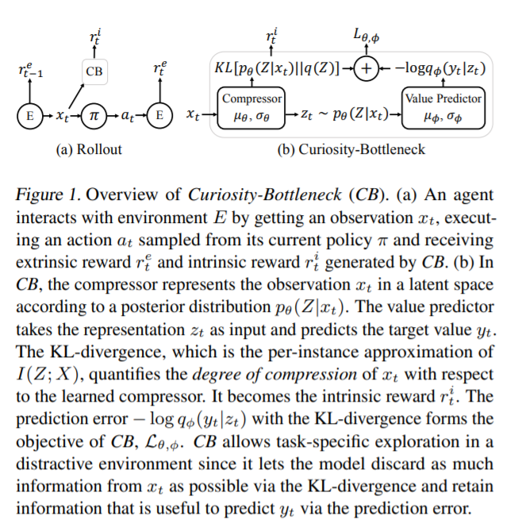

optimize variational bound. 

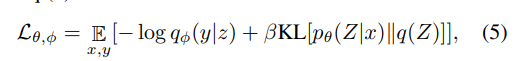

KL as regularization.

#### Surprising, difficult and confusing part

surprising: explain why IB.

1. minimize the average code-length of observation x -> minimize entropy H(Z).
2. discard information of x to exclude task-irrelevant information -> maximize entropy H(Z|X).
3. preserve information related to Y -> maxmize I(Z;Y).

difficult and confusing : the derivative of intrinsic reward.

 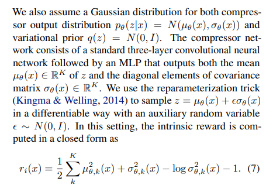

#### Experiments and baselines

baselines: CB-noKL, RND, SimHash.

exps:

1. mnist: detect novelty of KL(p|q).
2. atari: mr 2500(below RND in case without distraction).

#### How to apply and anywhere

IB based method to do exploration. 

IB can be seen as a β-VAE.

#### [blog](https://zhuanlan.zhihu.com/p/163745016)

[BACK TO LIST](#exploration)

### RE3 Random Encoders for Efficient Exploration

### [State Entropy Maximization with Random Encoders for Efficient Exploration{2102}](https://arxiv.org/abs/2102.09430)

#### Main contribution and core idea

contribution:

1. **efficient** exploration in high dimension observation.
2. using **random encoders** to get more diversity and computing efficiency.

core idea:

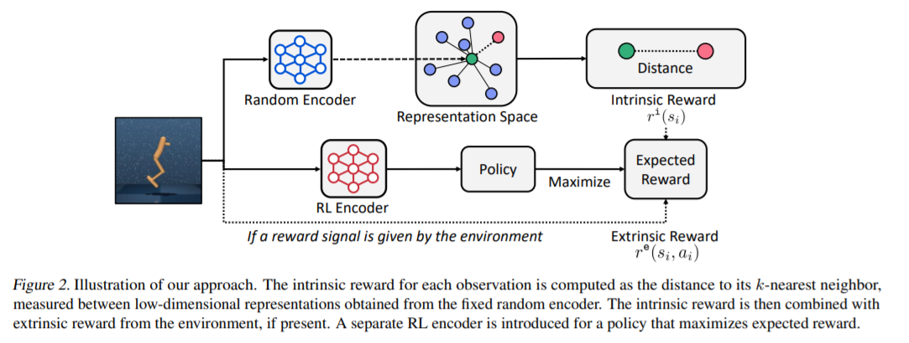

1. random encoders(no gradient computation).
2. utilize k-nearest neighbors to estimate entropy(approximately).

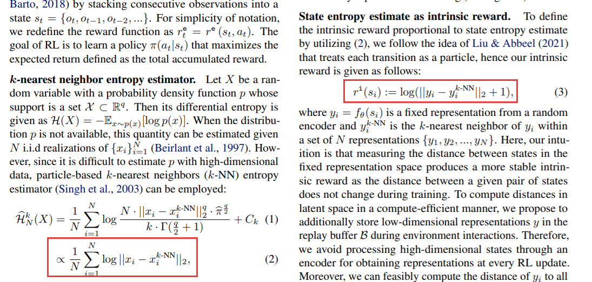

#### Surprising, difficult and confusing part

surprising: k-nearest neighbors entropy estimator and random encoders.

why random encoders(the intuition behind): representation of random encoder effectively captures information about similarity between states.

#### Experiments and baselines

exps: many abiliation exps. tasks in deepmind control suite and minigrid benchmark.

baselines: DrQ, RAD, Dreamer. 

#### How to apply and anywhere

how: I want to use re3 with dreamer in carla(mostly dreamer).

anywhere:

1. random encoder: many papers but this is interesting for suing entropy as exploration(usually in prediction based exploration).
2. k-nearest neighbors: many papers illustrated in this paper(let it be further reading).

#### Anything to further read

k-nearest neighbors: Mutti(2021). Tao(2020). Badia(2020). Liu & Abbeel(2021). Srinivas(2020).

maximize the entropy of the action space: Harrnoja(2018).

random encoders for generalization: Lee(2020).

Algorithms: DrQ(2021), RAD(2020).

[BACK TO LIST](#exploration)

### Imagined Goals

### [Visual Reinforcement Learning with Imagined Goals{1807}](https://arxiv.org/abs/1807.04742)

#### Main contribution and core idea

contribution: 

1. propose a pipeline: train agent to achieve some imagined goals(states) to fast adapt downstream target goals by self-driven exploration.
2. goal relabeling to improve sample efficiency.

core idea:

1. pretrain VAE.
2. utilize a prior distribution as a goal.
3. intrinsic reward r is defined as latent space.

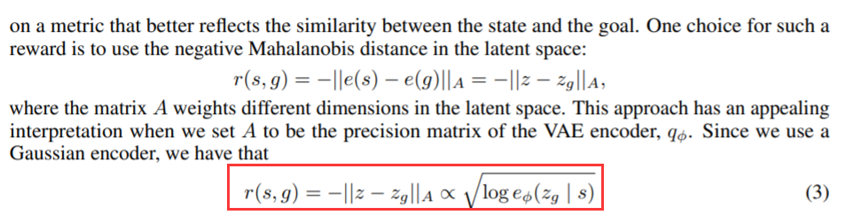

1. goal state as information when test(goal conditioned policy). 

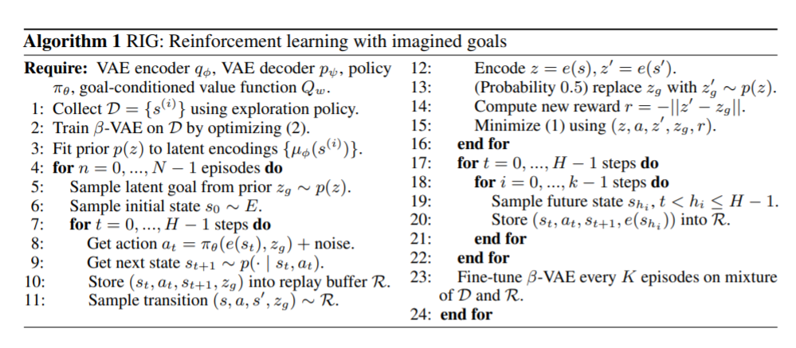

#### Surprising, difficult and confusing part

surprising:

1. goal relabeling to expand sample(same data like (s,a) with different goals).
2. pretrained VAE will be finetuned every K  episodes.

#### Experiments and baselines

not carefully read.

baseline: HER, DSAE.

#### How to apply and anywhere

how: learn skill for pretrain.

[BACK TO LIST](#exploration)

### Skew-Fit

### [Skew-Fit: State-Covering Self-Supervised Reinforcement Learning{1903}](https://arxiv.org/abs/1903.03698)

#### Main contribution and core idea

contribution: 

1. define the formal exploration objective for goal-policy.
2. propose an algo to max entropy of a goal distribution with entropy monotonously increase.

core idea: max H(S) - H(S|G) -> max H(G) - H(G|S) 

max H(G) means diverse goals, min H(G|S) means reach goal fast(determinant).

How to optimize:  

1. max H(G)

.png)

Then introduce SIR(sampling importance resampling) to reduce variance.

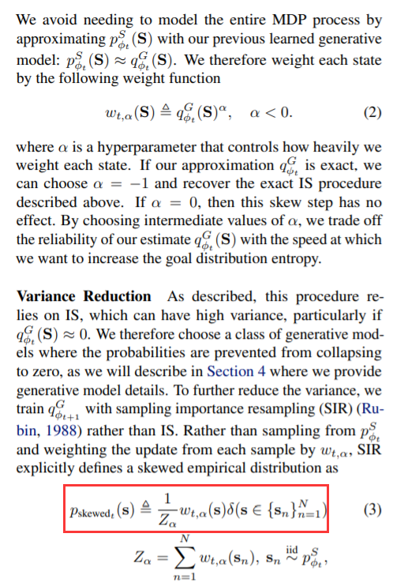

2. max -H(G|S) -> max its lower bound and train a policy to maximize the reward(MLE).

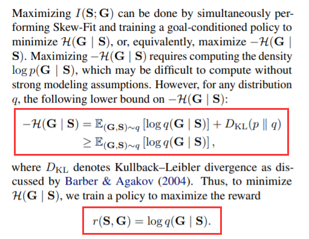

3. overall algo

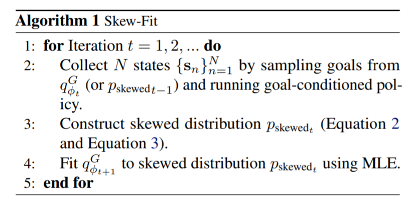

#### Surprising, difficult and confusing part

surprising: using SIR(sampling importance resampling) which is from 1988.

diff: math proof(not carefully read)

#### Experiments and baselines

baselines: HER, rank-based policy, autogoal GAN, GAN {bala}, #-exploration.

exps are good. 

#### How to apply and anywhere

how:

1. method: assume new -> change new -> ignore new
2. U(s) can be replaced expert prior.

[BACK TO LIST](#exploration)

### Dynamics Generalization via Information Bottleneck

### [Dynamics Generalization via Information Bottleneck in Deep Reinforcement Learning{2008}](https://arxiv.org/abs/2008.00614)

#### Main contribution and core idea

contribution: 

1. using IB as an regularization for exploration and generalization.
2. propose annealing scheme: add noise to encoder to get ability of generalization.

core idea:

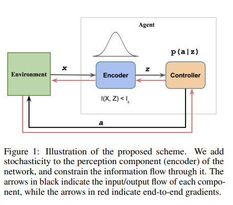

1. optimization: variantional p -> q(0, I)

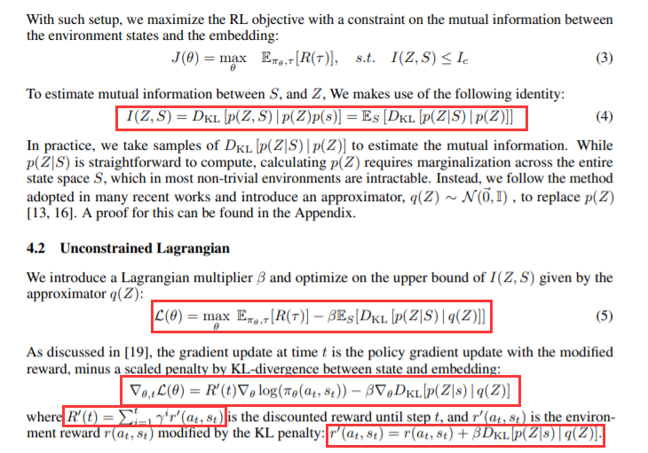

2. Annealing schema: increasing β

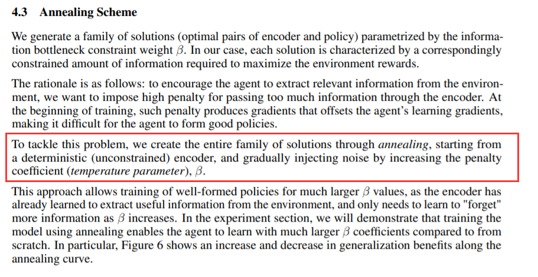

#### Surprising, difficult and confusing part

surprisng: IB -> KL as regularization for generalization.

#### Experiments and baselines

no explicit baseline, the exps are focusing about generilization.

exps are done by chaging env's parameters.

#### How to apply and anywhere

apply in AD(which the author thinks so).

I think this paper's idea is very similar to INFOBot. 

[BACK TO LIST](#exploration)

