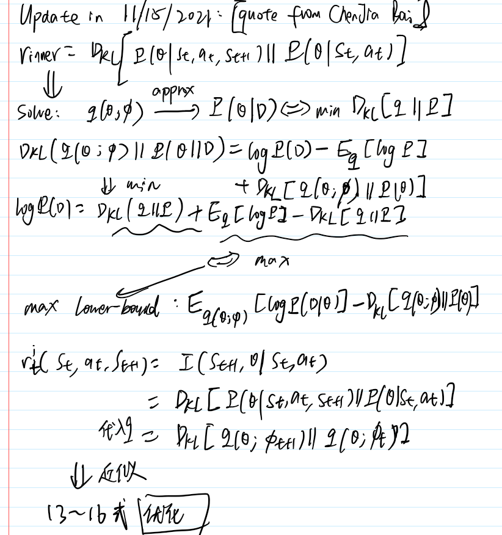

# readinglist

## Exploration

### [VIME: Variational Information Maximizing Exploration](https://arxiv.org/abs/1605.09674)

#### Main contribution and core idea

1. agent's goal of choosing an action: max the information gain. (max the reduction in uncertainty)
2. variational inference to approximate mutual information along trajs.
3. implementation: BNNs, parameters represetation trick.

#### Surprising, difficult and confusing part

surprising: model good to explain the goal is to max the reduction in uncertainty.

difficult: theoretical math with practical implementation

### Experiments and baselines

Just so so. No strong baselines.

#### How to apply and anywhere

max the information gain(mutual information).

#### [blog](https://www.zhihu.com/search?type=content&amp;q=VIME)

