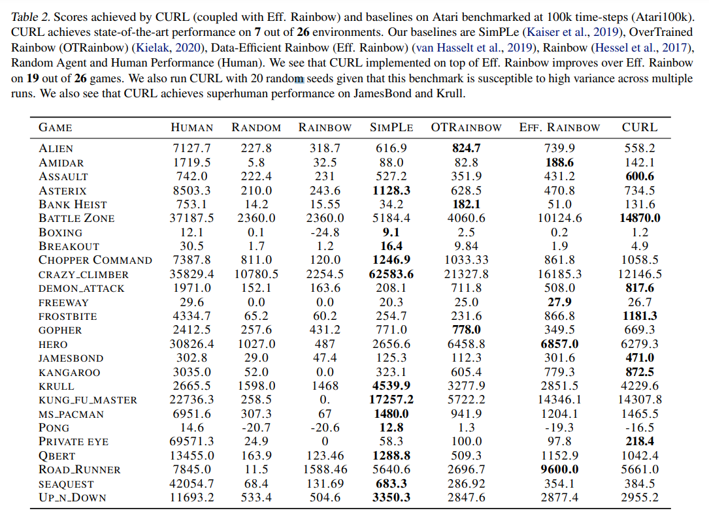
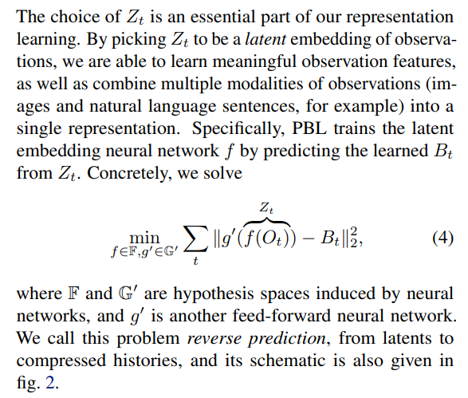
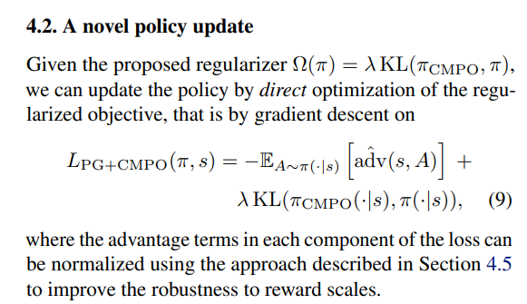
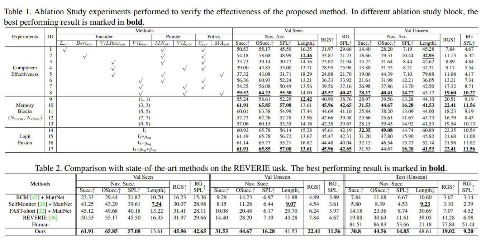
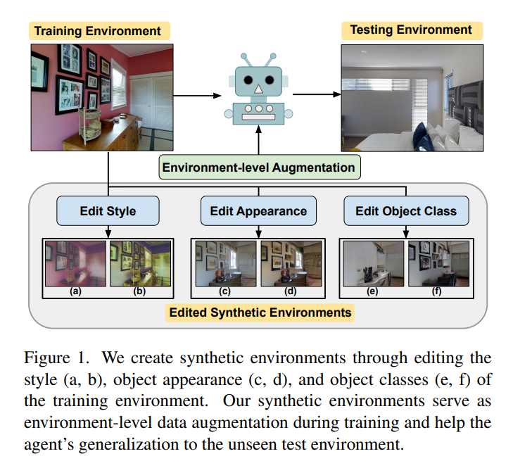
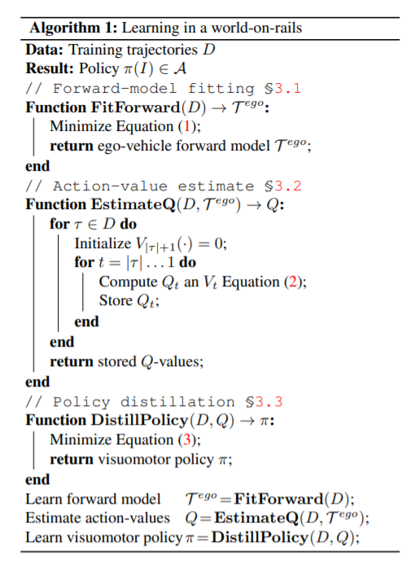
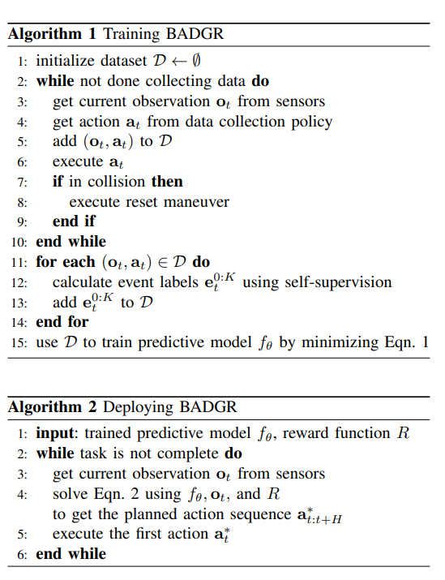

# readinglist

[Exploration in RL](#exploration)

[Model-based Learning in Autonomous Driving](#mb-ad)

[Visual-Language Navigation](#vln)

[Others](#others)

## Exploration

### 2022

### 2021

[Dynamic Bottleneck for Robust Self-Supervised Exploration{2110}](#dynamic-bottleneck):fire::+1::wrench:

[State Entropy Maximization with Random Encoders for Efficient Exploration{2102}](#re3-random-encoders-for-efficient-exploration):fire::+1:

[Behavior From the Void: Unsupervised Active Pre-Training{2103}](#{behavior-from-the-void}-unsupervised-active-pre-training)

[Pretraining Representations for Data-Efficient Reinforcement Learning{2106}](#pretraining-representations-for-data-efficient-reinforcement-learning)

[Muesli: Combining Improvements in Policy Optimization{2104}](#muesli)

### 2020

[Dynamics Generalization via Information Bottleneck in Deep Reinforcement Learning{2008}](#dynamics-generalization-via-information-bottleneck)

[Planning to Explore via Self-Supervised World Models{2005}](#plan-to-explore)

[DATA-EFFICIENT REINFORCEMENT LEARNING WITH SELF-PREDICTIVE REPRESENTATIONS{2007}](#self-predictive-representations)

[Task-Agnostic Exploration via Policy Gradient of a Non-Parametric State Entropy Estimate{2007}](#k-nearest-neighbors-estimate-of-the-state-distribution-entropy)

[CURL: Contrastive Unsupervised Representations for Reinforcement Learning{2004}](#contrastive-unsupervised-representations-for-reinforcement-learning)

[Decoupling Representation Learning from Reinforcement Learning{2009}](#decoupling-representation-learning-from-reinforcement-learning)

[Bootstrap your own latent: A new approach to self-supervised Learning{2006}](#bootstrap-your-own-latent)

[Bootstrap Latent-Predictive Representations for Multitask Reinforcement Learning{2004}](#bootstrap-latent-predictive-representations-for-multitask-reinforcement-learning)

[The Value-Improvement Path: Towards Better Representations for Reinforcement Learning{2006}](#the-value-Improvement-path)

[Image Augmentation Is All You Need: Regularizing Deep Reinforcement Learning from Pixels](#drq)

[LEARNING INVARIANT REPRESENTATIONS FOR REINFORCEMENT LEARNING WITHOUT RECONSTRUCTION{2006}](#deep-bisimulation-for-control)

### Before 2020

[VIME: Variational Information Maximizing Exploration{1605}](#vime):+1:

[Self-Supervised Exploration via Disagreement{1906}](#self-supervised-exploration-via-disagreement):fire::+1:

[Deep Exploration via Bootstrapped DQN{1602}](#bootstrapped-dqn)

[Unifying Count-Based Exploration and Intrinsic Motivation{1606}](#unifying-count-based-exploration):+1:

[#Exploration: A Study of Count-Based Exploration for Deep Reinforcement Learning{1611}](#hash-exploration)

[EX2: Exploration with Exemplar Models for Deep Reinforcement Learning{1703}](#ex2)

[Incentivizing Exploration In Reinforcement Learning With Deep Predictive Models{1507}](#incentivizing-exploration-with-deep-predictive-models)

[Count-Based Exploration with Neural Density Models{1703}](#count-based-exploration-with-pixelcnn)

[Exploration by Random Network Distillation{1810}](#rnd):fire::+1:

[Randomized Prior Functions for Deep Reinforcement Learning{1806}](#random-prior-functions)

[Large-Scale Study of Curiosity-Driven Learning{1808}](#large-scale-study-of-curiosity-driven-learning)

[Curiosity-Bottleneck: Exploration By Distilling Task-Specific Novelty{ICML19}](#curiosity-bottleneck):fire:

[Visual Reinforcement Learning with Imagined Goals{1807}](#imagined-goals)

[Skew-Fit: State-Covering Self-Supervised Reinforcement Learning{1903}](#skew-fit)

[InfoBot: Transfer and Exploration via the Information Bottleneck{1901}](#infobot):fire::+1:

[Model-Based Active Exploration{1810}](#model-based-active-exploration)::+1::boom:

[Fast Task Inference with Variational Intrinsic Successor Features{1906}](#visr)

## Mb-AD

### 2022

[Learning from All Vehicles{2203}](#learning-from-all-vehicles)

### 2021

[Learning to drive from a world on rails{2105}](#world-on-rails):wrench:

[UMBRELLA_ Uncertainty-Aware Model-Based Offline Reinforcement Learning Leveraging Planning{nips21workshop}](#umbrella)

[RRL: Resnet as representation for Reinforcement Learning{2107}](#rrl)

[PsiPhi-Learning: Reinforcement Learning with Demonstrations using Successor Features and Inverse Temporal Difference Learning{2102}](#psiphi-learning)

[Learning by Watching{2106}](#learning-by-watching)

### 2020

[MODEL-BASED OFFLINE PLANNING{2008}](#mbop)

[MOPO: Model-based Offline Policy Optimization{2005}](#mopo)

[BADGR: An Autonomous Self-Supervised Learning-Based Navigation System{2002}](#badgr)

### Before 2020

[Uncertainty-driven imagination for continuous deep reinforcement learning{corl17}](#uncertainty-driven-imagination)

[The Cross Entropy method for Fast Policy Search{icml03}](#cross-entropy-policy-search)

[Deep Dynamics Models for Learning Dexterous Manipulation{1909}](#deep-dynamics-models-for-learning-dexterous-manipulation)

[MODEL-PREDICTIVE POLICY LEARNING WITH UNCERTAINTY REGULARIZATION FOR DRIVING IN DENSE TRAFFIC{1901}](#model-predictive-policy-learning-with-uncertainty-regularization)

[Bayesian surprise attracts human attention{09xx}](#bayesian-surprise-attracts-human-attention)

## VLN

### 2022

[Visual-Language Navigation Pretraining via Prompt-based Environmental Self-exploration{2203}](#prompt-and-clip)

[EnvEdit: Environment Editing for Vision-and-Language Navigation{2203}](#envedit)

[REVE-CE: Remote Embodied Visual Referring Expression in Continuous Environment{2202}](#reve-ce)

### 2021

[REVERIE 2021 Winner](#reverie-2021-winner)

[Scene-Intuitive Agent for Remote Embodied Visual Grounding{2103}](#scene-intuitive-agent)

[Learning Transferable Visual Models From Natural Language Supervision{2103}](#clip)

[CrossViT: Cross-Attention Multi-Scale Vision Transformer for Image Classification{2103}](#cross-vit)

### 2020

[A Recurrent Vision-and-Language BERT for Navigation{2011}](#A-recurrent-vision-and-Language-bert-for-navigation)

### Before 2020

[REVERIE: Remote Embodied Visual Referring Expression in Real Indoor Environments{1904}](#reverie):wrench:

## Others

### 2022

### 2021

### 2020

### Before 2020

[System crash as dynamics of complex networks{PNAS16}](#system-crash-as-dynamics-of-complex-networks)

### VIME

### [VIME: Variational Information Maximizing Exploration{1605}](https://arxiv.org/abs/1605.09674)

#### Main contribution and core idea

1. agent's goal of choosing an action: max the information gain. (max the reduction in uncertainty)
2. variational inference to approximate mutual information along trajs.
3. implementation: BNNs, parameters represetation trick.

#### Surprising, difficult and confusing part

surprising: model good to explain the goal is to max the reduction in uncertainty.

difficult: theoretical math with practical implementation

#### Experiments and baselines

Just so so. No strong baselines.

#### How to apply and anywhere

max the information gain(mutual information).

#### [blog](https://www.zhihu.com/search?type=content&amp;q=VIME) and [notes](https://github.com/youngzhou1999/readinglist/tree/main/README.assets/VIME.png)

[BACK TO LIST](#exploration)

### Self-Supervised Exploration via Disagreement
### [Self-Supervised Exploration via Disagreement{1906}](https://arxiv.org/abs/1906.04161)

#### Main contribution and core idea

self-supervised to learn skills without external reward, learning completely from scratch.

idea: minimize prediction error and maximize the prediction difference at the same time.

#### Surprising, difficult and confusing part

good writing, easy to read, simple yet efficient algo. 

#### Experiments and baselines

atari, minist, maze, mujuco and real robot: good performance.

baselines: pathak 2017,large scale study of curiosity-driven{all prediction error based} 

#### How to apply and anywhere

no/sparse reward envs.

**check the multi-step method**.

[BACK TO LIST](#exploration)

### Bootstrapped DQN
### [Deep Exploration via Bootstrapped DQN{1602}](https://arxiv.org/abs/1602.04621)

#### Main contribution and core idea

contribution: a simple yet efficient DQN algorithm with good ability to explore.

core idea: multi-head q. inspired by TS(random choose head).

**Not tried to tract exact posterior and RANDOM initialization in drl.**

#### Surprising, difficult and confusing part

surprsing: use simple task to show the **distribution** of what learned, which is similar to the true posterior.

Their team  do exploration for a long time.(very persuasive and respect).

#### Experiments and baselines

atrai; DQN. exps are ok.

#### How to apply and anywhere

multi-head -> assemble model and disagreement.

how: **multi-step, pure-exploration.**

[BACK TO LIST](#exploration)

### Unifying Count-Based Exploration
### [Unifying Count-Based Exploration and Intrinsic Motivation{1606}](https://arxiv.org/abs/1606.01868)

#### Main contribution and core idea

contribution: unify pseudo-count in deep rl which is how to get hat{N(s)}, hat{n}. use model to build probability of counts.

core idea: use density model to produce density estimation and re-catch N(s), n. use pseudo-count to build a bonus.(normally N^{1/2} or N^{-1}). 

#### Surprising, difficult and confusing part

surprising: make drl countable by transfering algo in traditional/small MDP.(count by table).

diff: math derive in PG.(But it's ok now).

#### Experiments and baselines

atari, DQN, UCB.  good performance. using DQN with bonus can work well in montezuma's revenge(15 rooms in 50m steps).

#### How to apply and anywhere

how: with other algo(or modify detail of count-based).

anywhere: pseudo-count algos always use this def. like pixelcnn, #count, ex2.

**mark here(22/1/4): pseudo-count algos are not that good when compared to other algos nowadays.**

[BACK TO LIST](#exploration)

### Hash Exploration
### [#Exploration: A Study of Count-Based Exploration for Deep Reinforcement Learning{1611}](https://arxiv.org/abs/1611.04717)

#### Main contribution and core idea

contribution: A count-based algo which can be used in multi-domain.

core idea: use sim-hash to build state count.

first part: maximize  the likelihood of output. second part: push b(s) into 0 or 1 to count better.  

#### Surprising, difficult and confusing part

surprising: use noise inject in sigmoid function(But didn't that popular in other place?).

#### Experiments and baselines

continuous: RLlab, VIME. 

ALE: (performance just so so), **using BASS future is well.**

conclusion: in continuous setting, it beats VIME. very good.

#### How to apply and anywhere

how: low dimension approximation(like vae).

[BACK TO LIST](#exploration)

 ### EX2

### [EX2: Exploration with Exemplar Models for Deep Reinforcement Learning{1703}](https://arxiv.org/abs/1703.01260)

#### Main contribution and core idea

contribution: 

1. based entirely on discriminative trained exemplar models. 

2. compare new state to past state.

3. no explicit density model.

core idea: 

discriminate new state from past states(no explicit density model to measure novelty).

where D is a NN.

#### Surprising, difficult and confusing part

surprising: good math story and exps.

difficult: math derivative in eq(1) with implicit density estimation. 

#### Experiments and baselines

baselines: VIME, #exploration, TRPO

exps are good. beat VIME, similar with #.

#### How to apply and anywhere

the idea of new state/past states distinguish is good. but none otherwhere.

[BACK TO LIST](#exploration)

### Incentivizing Exploration With Deep Predictive Models

### [Incentivizing Exploration In Reinforcement Learning With Deep Predictive Models{1507}](https://arxiv.org/abs/1507.00814)

#### Main contribution and core idea

contribution: a learned system dynamics as forward model and using **prediction error** as bonus.

core idea: [notes](https://github.com/youngzhou1999/readinglist/tree/main/README.assets/incentivizing.png)

#### Surprising, difficult and confusing part

surprising: model M is rather simple as σ.

#### Experiments and baselines

DQN+bonus, atari(with static/dynamic AE).

baseline: DQN + other traditional bonus.

In atari, it's useful.

#### How to apply and anywhere

**prediction error bonus** with **model-based(learning) exploration** have many paper(simple, efficient).

[BACK TO LIST](#exploration)

### Count-based Exploration with PixelCNN

### [Count-Based Exploration with Neural Density Models{1703}](https://arxiv.org/abs/1703.01310)

#### Main contribution and core idea

contribution: use complicated density model and explain the role of monte carlo in exploration.

core idea: use PixelCNN as density model.

#### Surprising, difficult and confusing part

surprising: MMC is rather good.(monte-carlo in exloration as noise)

difficult: no source code.

confusing: how to deal with 4 channel  in atrai with pixelcnn(maybe on channel).

#### Experiments and baselines

atrai, dqn mc/no mc, dqn cts, reactor with retrace.

exps are good, but re-cons in minigrid is painful.

#### How to apply and anywhere

how: mmc or mc(long horizon) in exploration is good.

[BACK TO LIST](#exploration)

### RND

### [Exploration by Random Network Distillation{1810}](https://arxiv.org/abs/1810.12894)

#### Main contribution and core idea

contribution: a new way to explore by **prediction error**. montezuma's revenge beats human.

core idea: use a **random & fixed** network as target.

intuition: for a network f, the prediction error is higher when the input x is more different with the data it has seen before. 

#### Surprising, difficult and confusing part

surprising: conclude 4  reasons for high prediction error.

1. training data not enough.
2. stochastic objective function
3. wrong model
4. problem with optimization.

we encourage 1 and discourage 2,3,4.

training setting detail: 

1. non episodic in intrinsic training(constant information for exploration).
2. episodic for extrinsic training(as a ddl in case of agent stuck in the start).

confusing: actual frame is more than figure(maybe figure cut).

#### Experiments and baselines

PPO, RND, Dynamics(Hagan 2018).

ablation: 1. cnn, rnn 2. num of envs 3. episodic/non-episodic

conclusion: 

1. in no extrinsic reward setting, non-episode perform better.
2. in extrinsic rewarad setting, **reward comes from two head(extrinsic and intrinsic)**.

#### How to apply and anywhere

how: policy with random network to get a boarder distribution.

anywhere: lilichen's new paper and ngu.

#### [blog](https://zhuanlan.zhihu.com/p/146309991)

[BACK TO LIST](#exploration)

### Random Prior Functions

### [Randomized Prior Functions for Deep Reinforcement Learning{1806}](https://arxiv.org/abs/1806.03335)

#### Main contribution and core idea

contribution: 

1. improve bootstrapped q, analysis prior in rl.
2. design a random, untrained **prior** network.

core idea: 

prior + noise  -> ensemble diverse -> posterior(random) like TS.

#### Surprising, difficult and confusing part

easy to read.

#### Experiments and baselines

baselines: epsilon-greedy, bootstrapped(bs), BSR(bs + L2), BSP(bs + prior)

exps:

1. scale up
2. carpole, swing-up

3. MR: BSP 2000+(good for dqn based)

#### How to apply and anywhere

how: prior regularize. (maybe) for any objetcive function in rl, we can add a **random, fixed and untrained network to encourage exploration**.

anywhere:  RND

[BACK TO LIST](#exploration)

### Large-Scale Study of Curiosity-Driven Learning

### [Large-Scale Study of Curiosity-Driven Learning{1808}](https://arxiv.org/abs/1808.04355)

#### Main contribution and core idea

contribution: 

1. explore the good/limits of curiosity based exploration(prediction error).
2. discuss the φ(x) and its performance in origin/generation setting.

core idea:

#### Surprising, difficult and confusing parts

surprising: 

1. pre-trained VAE: biased to where the agent started.
2. normalization: advantage, obs, reward
3. **inf horizon**

#### Experiments and baselines

may aspects:

1. embedding: origin random good. generation: learned good.
2. parallel env 128, very useful.
3. noisy-tv is the limit of curiosity based.

#### How to apply and anywhere

pure exploration, inf horizon setting.

anywhere: RND(although they are in the same period).

#### [blog](https://zhuanlan.zhihu.com/p/84998411)(rather good)

[BACK TO LIST](#exploration)

### Dynamic Bottleneck

### [Dynamic Bottleneck for Robust Self-Supervised Exploration{2110}](https://arxiv.org/abs/2110.10735)

#### Main contribution and core idea

contribution: 

1. handle dynamic-irrelevant information target robust policy(handle noisy env).
2. build intrinsic reward for self-supervised exploration.

core idea:

1. use **Information bottleneck(and contrastive learning)** to get a good reprresentation and use variational method to optimize.
2. build a bonys with Kl-divergence(encoder | Gaussian) as self-supervised exploration.

#### Surprising, difficult and confusing part

surprising: use variational method to optimize the upper/lower bound of the objective(holds for non negativity of KL-divergence).

difficult: 

1. introduce InfoNCE loss's proof.
2. relationship/similarity of count-based/curiosity-based exploration in linear/small tabular case.

#### Experiments and baselines

exps are done in atari. results are good.

baselines: ICM, Disagreement, Curiosity Bottleneck, Random(for SSE).

exps:

1. SSE setting
2. white-noisy env
3. abiliation
4. visualization of representation in low dimention.

#### How to apply and anywhere

how:

1. intrinsic reward for SSE(**normally constrain encoder to a boarder distribution)**

2. variational method  for information-based exloration.

anywhere: several IB-based exploration paper.

#### Anything to further read

- [x] SSL: [18] NIPS20. [46] ICLR21.

- [x] Curiosity Bottleneck: [26] ICML19.

- [ ] in AD noise: [34] arXiv 18

- [x] RE3(enropy-based): [47] ICML 21.

[BACK TO LIST](#exploration)

### Curiosity Bottleneck

### [Curiosity-Bottleneck: Exploration By Distilling Task-Specific Novelty{ICML19}](http://proceedings.mlr.press/v97/kim19c.html)

#### Main contribution and core idea

contribution: use Information Bottleneck to distill task-specific novelty of state.

core idea:

optimize variational bound. 

KL as regularization.

#### Surprising, difficult and confusing part

surprising: explain why IB.

1. minimize the average code-length of observation x -> minimize entropy H(Z).
2. discard information of x to exclude task-irrelevant information -> maximize entropy H(Z|X).
3. preserve information related to Y -> maxmize I(Z;Y).

difficult and confusing : the derivative of intrinsic reward.

 

#### Experiments and baselines

baselines: CB-noKL, RND, SimHash.

exps:

1. mnist: detect novelty of KL(p|q).
2. atari: mr 2500(below RND in case without distraction).

#### How to apply and anywhere

IB based method to do exploration. 

IB can be seen as a β-VAE.

#### [blog](https://zhuanlan.zhihu.com/p/163745016)

[BACK TO LIST](#exploration)

### RE3 Random Encoders for Efficient Exploration

### [State Entropy Maximization with Random Encoders for Efficient Exploration{2102}](https://arxiv.org/abs/2102.09430)

#### Main contribution and core idea

contribution:

1. **efficient** exploration in high dimension observation.
2. using **random encoders** to get more diversity and computing efficiency.

core idea:

1. random encoders(no gradient computation).
2. utilize k-nearest neighbors to estimate entropy(approximately).

#### Surprising, difficult and confusing part

surprising: k-nearest neighbors entropy estimator and random encoders.

why random encoders(the intuition behind): representation of random encoder effectively captures information about similarity between states.

#### Experiments and baselines

exps: many abiliation exps. tasks in deepmind control suite and minigrid benchmark.

baselines: DrQ, RAD, Dreamer. 

#### How to apply and anywhere

how: I want to use re3 with dreamer in carla(mostly dreamer).

anywhere:

1. random encoder: many papers but this is interesting for suing entropy as exploration(usually in prediction based exploration).
2. k-nearest neighbors: many papers illustrated in this paper(let it be further reading).

#### Anything to further read

- [ ] k-nearest neighbors: Mutti(2021). Tao(2020). Badia(2020). Liu & Abbeel(2021). Srinivas(2020).

- [ ] maximize the entropy of the action space: Harrnoja(2018).

- [ ] random encoders for generalization: Lee(2020).

- [ ] Algorithms: DrQ(2021), RAD(2020).

[BACK TO LIST](#exploration)

### Imagined Goals

### [Visual Reinforcement Learning with Imagined Goals{1807}](https://arxiv.org/abs/1807.04742)

#### Main contribution and core idea

contribution: 

1. propose a pipeline: train agent to achieve some imagined goals(states) to fast adapt downstream target goals by self-driven exploration.
2. goal relabeling to improve sample efficiency.

core idea:

1. pretrain VAE.
2. utilize a prior distribution as a goal.
3. intrinsic reward r is defined as latent space.

1. goal state as information when test(goal conditioned policy). 

#### Surprising, difficult and confusing part

surprising:

1. goal relabeling to expand sample(same data like (s,a) with different goals).
2. pretrained VAE will be finetuned every K  episodes.

#### Experiments and baselines

not carefully read.

baseline: HER, DSAE.

#### How to apply and anywhere

how: learn skill for pretrain.

[BACK TO LIST](#exploration)

### Skew-Fit

### [Skew-Fit: State-Covering Self-Supervised Reinforcement Learning{1903}](https://arxiv.org/abs/1903.03698)

#### Main contribution and core idea

contribution: 

1. define the formal exploration objective for goal-policy.
2. propose an algo to max entropy of a goal distribution with entropy monotonously increase.

core idea: max H(S) - H(S|G) -> max H(G) - H(G|S) 

max H(G) means diverse goals, min H(G|S) means reach goal fast(determinant).

How to optimize:  

1. max H(G)

.png)

Then introduce SIR(sampling importance resampling) to reduce variance.

2. max -H(G|S) -> max its lower bound and train a policy to maximize the reward(MLE).

3. overall algo

#### Surprising, difficult and confusing part

surprising: using SIR(sampling importance resampling) which is from 1988.

diff: math proof(not carefully read)

#### Experiments and baselines

baselines: HER, rank-based policy, autogoal GAN, GAN {bala}, #-exploration.

exps are good. 

#### How to apply and anywhere

how:

1. method: assume new -> change new -> ignore new
2. U(s) can be replaced expert prior.

[BACK TO LIST](#exploration)

### Dynamics Generalization via Information Bottleneck

### [Dynamics Generalization via Information Bottleneck in Deep Reinforcement Learning{2008}](https://arxiv.org/abs/2008.00614)

#### Main contribution and core idea

contribution: 

1. using IB as an regularization for exploration and generalization.
2. propose annealing scheme: add noise to encoder to get ability of generalization.

core idea:

1. optimization: variantional p -> q(0, I)

2. Annealing schema: increasing β

#### Surprising, difficult and confusing part

surprisng: IB -> KL as regularization for generalization.

#### Experiments and baselines

no explicit baseline, the exps are focusing about generilization.

exps are done by chaging env's parameters.

#### How to apply and anywhere

apply in AD(which the author thinks so).

I think this paper's idea is very similar to INFOBot. 

[BACK TO LIST](#exploration)

### InfoBot

### [InfoBot: Transfer and Exploration via the Information Bottleneck{1901}](https://arxiv.org/abs/1901.10902)

#### Main contribution and core idea

contribution: 

1. using IB between the agent's goal and policy to achieve better policy transfer across tasks.

2. building an intrinsic reward(MI) to encourage exploration.  

core idea: 

1. IB as a regularization when optimize goal-conditional policy.

2. building a exploration bonus to do transfer.

#### Surprising, difficult and confusing part

surprising: using train env set and test env set to show transfer ability.

confusing: **how to introduce a training env set?** the paper samples task(if in carla, the the train route is the traning set). 

and it's trained on minigrid, I need to check the code especially obs input.

difficult: the derivation of the gradient of the objective J(θ).

#### Experiments and baselines

exps are two main parts: 

1. direct policy transfer

in minigrid, train on one env, evaluate on an new env.

baseline: a2c, infobot-no KL. infobot's performance good.

2. transferable exploration strategy

minigrid, trained on easier env, and transfer to harder env.

baselines: a2c, vime, count-based, curiosity-based(ICM)

infobot transfers well.

#### How to apply and anywhere

vln goal-conditional policy.

carla transfer routes.

#### Anything to further read

- [ ] derivation: score function setimator(williams,1992; Sutton,1999). Strouse18.

- [ ] cognitive science: miller and cohen2001.

[BACK TO LIST](#exploration)

### Model-Based Active Exploration

### [Model-Based Active Exploration{1810}](https://arxiv.org/abs/1810.12162)

#### Main contribution and core idea

contribution: 

1. use ensemble of forward models to observe novelty.

how  to measure novelty: derived from a bayesian prospective->estimate by disaggrenment.

2. propose task-agnostic models(reactive -> active).

core idea: using bayesian derivation to defien a U(s,a) function, than estimate it via disagreement.

measure novelty: Infomation gain with transition function.

 

#### Surprising, difficult and confusing part

surprising: 

1. pure exploration setting.
2. using transitions(model-based) to formulate the IG.

difficult: derivation.

#### Experiments and baselines

baselines: 

1. exploration bonus dqn and bootstrapped dqn(all reactive).
2. ablation: traj vairance, JRD, Predicion error(pathak 17).

envs: ant maze, chain env, half cheetah. performance good.

#### How to apply and anywhere

bayesian derivation of IG in MBRL setting.

anywhere: pathak 19(disagreement).

#### Anything further to read

- [ ] Itti & baldi 09 surprise and human attention.

[BACK TO LIST](#exploration)

### Plan to Explore 

### [Planning to Explore via Self-Supervised World Models{2005}](https://arxiv.org/abs/2005.05960)

#### Main contribution and core idea

contribution: 

1. **planning to seek out expected future novelty**
2.  **model learning-task agnostic exploration**

core idea:  combine dreamer and disagreement, **but** with novelty:

1. **plan to get essemble**(fake trajs).
2. adaption: good performance in zero/few shot setting.

#### Surprising, difficult and confusing part

surprising: model learning based on planning.

difficult: the idea of combination and own novelty.

#### Experiments and baselines

continues setting with **strong baselines**: dreamer(as std), curiosity, MAX, Retrospectvie(pathak 19).

#### How to apply and anywhere

using latent fake disagreement to get world medel and fast adaption.

[BACK TO LIST](#exploration)

### SELF-PREDICTIVE REPRESENTATIONS

### [DATA-EFFICIENT REINFORCEMENT LEARNING WITH SELF-PREDICTIVE REPRESENTATIONS{2007}](https://arxiv.org/pdf/2007.05929.pdf)

#### Main contribution and core idea

contribution: propose a data-efficient method for rl.

core idea: a auxiliary loss term to do self-predictive representation.

 

#### Surprising, difficult and confusing part

surprising: 

1. self learning by predict its own latent representations **multiple steps**
2. **momenta** encoder update(in this paper called exponential moving average)
3. data aug to improve performance(also no data aug which makes it **efficient**).

#### Experiments and baselines

exps: 26 atari 100k baselines: drq, curl 

performance is rather good.

 

abi study: focus on time step, l2 loss, projection

**this is actually failure in some way but means a lot for final success .**

#### How to apply and anywhere

[BACK TO LIST](#exploration)

### k-nearest neighbors estimate of the state distribution entropy 

### [Task-Agnostic Exploration via Policy Gradient of a Non-Parametric State Entropy Estimate{2007}](https://arxiv.org/pdf/2007.04640.pdf)

#### Main contribution and core idea

contribution: proposed a novel exploration algo via state entropy maximization in reward-free setting.

core idea: using **non-parametric** estimator(**K-NN estimator**) to calculate entropy and proposed trust-region entropy maximization.

algo:

where the calculation is as below(proof can be seen in appendix in original paper): 

#### Surprising, difficult and confusing part

surprising: up stream pre-train(or called **representation learning**) to fast adapt to down stream task(with reward).

#### Experiments and baselines

exps are done in mujuco and minigrid.

baslines: maxent. performance good.

#### How to apply and anywhere

vln pre-train or representation learning.

[BACK TO LIST](#exploration)

### {Behavior From the Void} Unsupervised Active Pre-Training

### [Behavior From the Void: Unsupervised Active Pre-Training{2103}](https://arxiv.org/pdf/2103.04551.pdf)

#### Main contribution and core idea

contribution: proposed a unsup-rl algo to explore efficiently in reward free envs.

core idea: using knnestimate entropy in an abstract representation space and a contrastive learning loss.

 

knn part(similar to other paper):

algo(simple to understand): 

#### Surprising, difficult and confusing part

surprising: the derivation of max-entropy exloration is good by variational lower bound.

#### Experiments and baselines

exps are done in atrai and dmc. which are both good.

baselines are tricky: 

1.  dmc:

one is count-based with drq(claimed as sota) and the other is drq from scratch.

2. atari:

many baselines: curl, drq, spr, visr.

#### How to apply and anywhere

contrastive representation in ad for vae based model.

[BACK TO LIST](#exploration)

### Contrastive Unsupervised Representations for Reinforcement Learning

### [CURL: Contrastive Unsupervised Representations for Reinforcement Learning{2004}](https://arxiv.org/abs/2004.04136)

#### Main contribution and core idea

contribution: proposed contrastive representation **for data efficiency** in RL for the first time.

core idea: contrastive loss by random crop.

algo:

#### Surprising, difficult and confusing part

easy to understand and **contrastive representation** easily adapt to other rl algo.

#### Experiments and baselines

exps are done in dmc with sac, atari with rainbow.

**the author claim that CURL is the first image-based algorithm to nearly match the sample-efficiency of methods that use state-based features.**

1. dmc

baselines: planet,dreamer(both mb), sac

2. atari

baselines: rainbow, simple(dyna like in dnn), otrrainbow(2020), efftrainbow(2019)

#### How to apply and anywhere

contrastive learning for better representation.

[BACK TO LIST](#exploration)

### Decoupling Representation Learning from Reinforcement Learning

### [Decoupling Representation Learning from Reinforcement Learning{2009}](https://arxiv.org/abs/2009.08319)

#### Main contribution and core idea

contribution: 

1. proposed a offline ul called ATC to decouple jointly training of ul an rl.

2. proposed encoder pre-training benchmark and find ATC outperforms other ul algos.

core idea: curl(augmented contrast) with multi time-step **augmented temporal contrast**. 

algo: easy to understand

#### Surprising, difficult and confusing part

why unsup rl: 

1. purpose to learn visual fetures for rl without rewards.
2. mutil-task(env demos) pretrain for fast down-stream finetune. 

why contrastive learning(like atc here) work:

- encourages the learned encoder to **extract meaningful elements** of the strcture of th mdp from obs.

#### Experiments and baselines

exps are done in dmc control, dmc lab and atari. baselines: standard rl, curl(or ac), vae-t(a time delay to the target obs).

performance: it beats curl.

encoder benchmark: performance good.

**multi-task encoder** is done, too(in mujuco). it shows generalization.

#### How to apply and anywhere

multi-time ul helps pre-training.

#### Anything Further Reading

driving simulators(Dosovit-skiy et al., 2017).

[BACK TO LIST](#exploration)

### Bootstrap your own latent

### [Bootstrap your own latent: A new approach to self-supervised Learning{2006}](https://arxiv.org/abs/2006.07733)

#### Main contribution and core idea

contribution: proposed a new ssl algo to learn image representations without using negative pairs.

core idea: using two networks referred as online and target.

1. online predict the target's representation of the same image under different augmented view.
2. update the target with a slow-moving average of the online at the same time.

#### Surprising, difficult and confusing part

512tpu with bs 4096.

#### Experiments and baselines

exps are done in imagenet.

#### How to apply and anywhere

ssl/contrastive.

[BACK TO LIST](#exploration)

### Bootstrap Latent-Predictive Representations for Multitask Reinforcement Learning

### [Bootstrap Latent-Predictive Representations for Multitask Reinforcement Learning{2004}](https://arxiv.org/abs/2004.14646)

#### Main contribution and core idea

contribution: proposed a algo to learn representation for multitask rl.

core idea: 

1. predicting latent embeddings of future observations(focus on capturing structured info about dynamics).
2. reverse prediction for multi-step.

loss:

#### Surprising, difficult and confusing part

lantent embedding s are themselves trained to be predictive of the aforementioned representations allowing the agent to learn more about the key aspects of the env dynamics.

steps: 20.

#### Experiments and baselines

epxs are done in dmlab-30 and atari-57 multi-task setting.

performance good.

#### How to apply and anywhere

reverse prediction.

[BACK TO LIST](#exploration)

### Pretraining Representations for Data-Efficient Reinforcement Learning

### [Pretraining Representations for Data-Efficient Reinforcement Learning{2106}](https://arxiv.org/abs/2106.04799)

#### Main contribution and core idea

contribution: proposed a algo to learn good representation for unsup rl(upstream pretrain).

core idea: this is a follow work of spr. it consists of 3 parts:

1. spr: self predictive representation
2. inverse modeling(classifcation for a_t)
3. goal-conditioned rl

algo called **sgi**(spr with goal-conditioned and inverse modeling)

#### Surprising, difficult and confusing part

there are many good papers in it which is good for further reading.

#### Experiments and baselines

envs: atari 100k with different type of data.

baselines: visr, apt, cpt, atc, (no pretrain following)simple, der, drq, spr.

abi study: 1. no pretrain 2. exploratory data 3. offline data.

#### How to apply and anywhere

[BACK TO :LIST](#exploration)

### VISR

### [Fast Task Inference with Variational Intrinsic Successor Features{1906}](https://arxiv.org/abs/1906.05030)

#### Main contribution and core idea

contribution: combine two novel techniques

1. train mdp by rewarding a policy for being distinguishable from other policies.
2. successor features.

proposed a unsup rl algo for fast task inference.

core idea: learn controllable features based on behavioral mutual information(which is a class of method).

**force the objective in Mutual Information to be equal with successor features**.

pipeline: two nn respect to reward and value. w as the task vector.

algo: 

#### Surprising, difficult and confusing part

difficult part: equation 10 w from Von Mises-Fisher distribution(the paper says this is one way).

#### Experiments and baselines

exps are done in atari57. baseline: diayn. and other full rl algo such as ppo and simple.

all task is inference for 100k.

beat diayn very hard.

#### How to apply and anywhere

successor feature is more familiar to me.(a reward and a value).

[BACK TO LIST](#exploration)

### Muesli

### [Muesli: Combining Improvements in Policy Optimization{2104}](https://arxiv.org/abs/2104.06159)

#### Main contribution and core idea

contribution: proposed a novel policy update algo which combines regularized policy optimization with model learning as an auxiliary loss.

core idea:

1. regularized policy optimization(clipped mpo)

obj:

policy:

more detail about approximating kl:

2. model learning: using it to get a mutli-step approximation.

specifically, the model is used to 

- estimate the action value q, which is used to estimate the multi=step return.
- estimate advantage.

#### Surprising, difficult and confusing part

the understanding for policy optimization.

1. the defi:

2. the good tricks/essential for good policy training.

#### Experiments and baselines

deepmind:)

#### How to apply and anywhere

good explain for the following two thing.

model learning for multi-time value learning.

policy optimization regularization.

[BACK TO LIST](#exploration)

### The Value Improvement Path

### [The Value-Improvement Path: Towards Better Representations for Reinforcement Learning{2006}](https://arxiv.org/abs/2006.02243)

#### Main contribution and core idea

contribution: 

1. do much work on how to do representation to better approximate the value improvement path.

2. proposed two novel algos(auxiliary tasks) to approximate  

core idea: 

main claim: **approximate the past value-inprovement path may better approximate future functions on this path.**

past policies: do policy optimization with the past k policies.

past mixture: soft version of past policies. using a different lr for each task and using their average as the bootstrap target for all tasks.

#### Surprising, difficult and confusing part

reasons are good.

#### Experiments and baselines

atari with dqn with proposed tasks.

#### How to apply and anywhere

[BACK TO LIST](#exploration)

### DrQ

### [Image Augmentation Is All You Need: Regularizing Deep Reinforcement Learning from Pixels](https://arxiv.org/abs/2004.13649)

#### Main contribution and core idea

contribution: proposed a simple yet efficient algo for rl from pixels.

core idea: using data augmentation.

explain in mdp setting: **regularizing the value function through transformations of the input state.** 

optimize objective:

#### Surprising, difficult and confusing part

easy reasoning and good performance.

#### Experiments and baselines

atari 100k data efficiency.

dmc.

#### How to apply and anywhere

[BACK TO LIST](#exploration)

### Deep Bisimulation for Control

### [LEARNING INVARIANT REPRESENTATIONS FOR REINFORCEMENT LEARNING WITHOUT RECONSTRUCTION{2006}](https://arxiv.org/pdf/2006.10742.pdf)

#### Main contribution and core idea

contribution: a novel algo to learn good representations() for rl with image input.

core idea: using bisimulation theory to build latent representation.

objective: bellman operator.

#### Surprising, difficult and confusing part

bisimulation.

#### Experiments and baselines

#### How to apply and anywhere

[BACK TO LIST](#exploration)

### REVERIE

### [REVERIE: Remote Embodied Visual Referring Expression in Real Indoor Environments{1904}](https://arxiv.org/abs/1904.10151)

#### Main contribution and core idea

contribution: 

1. propose a dataset of varied and complex robot tasks.
2. Propose a novel Interactive Navigator-Pointer model as baseline.

core idea of baseline model:  combine SoTA pointer and navigator with an interactive manner to make more accurate action prediction.

SoTA Nvigator: FAST-short(FAST: sequence-to-sequence model with attention and backtracking).

SoTA Pointer: MAttNet.

proposed interactive manner: 1. encode top 3 object's labels(BiLstm). 2. encode object region information(Resnet FC7 layer).

#### Surprising, difficult and confusing part

None. I think this direction is more desirable in coding with neural network design and training.

#### Experiments and baselines

baselines: 

base: 

1. Random
2. Shortest
3. R2R-TF and R2R-SF(lstm with  attention)

SoTA:

1. SelfMonitor(didn't read clearly)
2. RCM(rl-based algo)
3. FAST-short and FAST-Lan-only(FAST-short + language only)

#### How to apply and anywhere

This task is worth doing(maybe). Because there is still a huge gap between human.

However, the SoTA algos nowadays is way to large with many vision-language pretrain.

#### [slides](https://youngzhou1999.github.io/pdfs/20220121.pdf)

[BACK TO LIST](#vln)

### REVERIE 2021 Winner

### [REVERIE 2021 Winner](https://github.com/YuankaiQi/REVERIE_Challenge/blob/master/2021-Winner-Tech-Report.pdf)

#### Main contribution and core idea

contribution: get SoTA performance on REVERIE challenge 2021(by using transformer-based model).

core idea: 

1. transformer model for cross modal information.
2. building a graphical map to do efficient planing.
3. disentangle the overall decision(stop policy and navigation policy both with cross-modal attention).

**hand-written model pipeline can be seen in slides below.**

#### Surprising, difficult and confusing part

difficult: not very familiar with transformer training and multi-modal attention.

#### Experiments and baselines

baselines(**need further reading**): 

- [ ] SIA

- [ ] Rec

- [ ] Airbert

#### How to apply and anywhere

based on its model, we can change the navigation policy.

#### Anything further to read

- [x] baselines: SIA: CVPR21. Rec: CVPR21. Airbert: ICCV21.

- [ ] cross-modal attention: LXMERT: arXiv19. 

#### [slides](https://youngzhou1999.github.io/pdfs/20220121.pdf)

[BACK TO LIST](#vln)

### Scene-Intuitive Agent

### [Scene-Intuitive Agent for Remote Embodied Visual Grounding{2103}](https://arxiv.org/abs/2103.12944)

#### Main contribution and core idea

contribution:

1. propose a new framework (two stage training): **scene grounding task** and **object grounding task** which are both pretrain task
2. memory-augmented attentive action decoder

core idea: using two pretrain tasks to help agent understand where to go and what to do

scene grounding task: get alignment score between one instruction and five viewpoint(find the most suitable).

object grounding task: given a pair of instruction and bounding boxs, find the best box.

#### Surprising, difficult and confusing part

difficult: need to get familiar with vilbert.

#### Experiments and baselines

#### How to apply and anywhere

the task of object grounding was used in 2021 winner.

[BACK TO LIST](#vln)

### A Recurrent Vision-and-Language BERT for Navigation 

### [A Recurrent Vision-and-Language BERT for Navigation{2011}](https://arxiv.org/abs/2011.13922)

#### Main contribution and core idea

contribution: 

1. fix the limitation of vision-and-language bert in navigation.
2. proposed a v&l **rec** bert for navigation for handling pomdp in navigation(requiring history-dependent attention).
3. the model can be used as a backbone for generalizing to other transformer archtectures.

core idea: define a state while doing attention(**recurrent function**)

the model: inied from a pre-trained v$l bert than fintuned on r2r and reverie.

#### Surprising, difficult and confusing part

surprising: one single GPU and has the potential to do other v&l problems along with navigation task.

#### Experiments and baselines

init in OSCAR helps a lot.

#### How to apply and anywhere

read the code and it can be used in vln.

[BACK TO LIST](#vln)

### REVE-CE

### [REVE-CE: Remote Embodied Visual Referring Expression in Continuous Environment{2202}](https://ieeexplore.ieee.org/document/9674225)

#### Main contribution and core idea

contribution: propose a vln env with **continuous action space** and a baseline algo.

core idea:

1. three work to do continuous action:

bounding box alignment, way point projection and continuous trajectory generation.

2. algo: rgb+d with multi-branch attention.

#### Surprising, difficult and confusing part

surprising: the exps are far low.

#### Experiments and baselines

#### How to apply and anywhere

can be a new setting.

[BACK TO LIST](#vln)

### CLIP

### [Learning Transferable Visual Models From Natural Language Supervision{2103}](https://arxiv.org/abs/2103.00020)

#### Main contribution and core idea

contribution: pretrain good model(rn and vit) in 400m image-text pair using contrastive learning.

core idea: 

#### Surprising, difficult and confusing part

#### Experiments and baselines

**efficient**

#### How to apply and anywhere

reverie

[BACK TO LIST](#vln)

### Cross-Vit

### [CrossViT: Cross-Attention Multi-Scale Vision Transformer for Image Classification{2103}](https://arxiv.org/abs/2103.14899)

#### Main contribution and core idea

contribution: propose a method for multi-scale feature representation in vit.

core idea: dual-arch mini-patch and large-patch with cross-attention for info fusion.

 

#### Surprising, difficult and confusing part

#### Experiments and baselines

#### How to apply and anywhere

[BACK TO LIST](#vln)

### prompt and clip in vln

### [Visual-Language Navigation Pretraining via Prompt-based Environmental Self-exploration{2203}](https://arxiv.org/pdf/2203.04006.pdf)

#### Main contribution and core idea

contribution: 

1. proposed a data aug method
2. proposed prompt for fast domain adaptation in vln.

core idea:

1. sample action and object to generate new traj and instruction pair by using templates and clip.

2. prompt 

not very familiar, but its useful according to ablation study.

#### Surprising, difficult and confusing part

surprising: clip as zero-shot and templates for generating new data pairs.

#### Experiments and baselines

exps in reverie and r2r. baselines: vilbert, vlnbert.

ablation study: 

1. task of mask language is useful in r2r. 

2. all with rank loss(useful).

#### How to apply and anywhere

[BACK TO LIST](#vln)

### EnvEdit

### [EnvEdit: Environment Editing for Vision-and-Language Navigation{2203}](https://arxiv.org/abs/2203.15685)

#### Main contribution and core idea

contribution: proposed a new env aug method for vln task.

core idea: edit env by three aspect: style(gan), appearance(gan) and object classes(mask).

and the author ensemble these augs and show that these methods are complementary.

#### Surprising, difficult and confusing part

surprising: easy yet efficient.

two types of methods in vln:

1. env aug: diff envs to help generalize to new/unseen envs.
2. data aug: pretrain with several tasks to help get more knowledge.

**a more general way(from the author):** style is the best trade-off between efficiency and performance.

#### Experiments and baselines

baselines: vil-clip(no pre-train sota), hamt(pre-train sota).

both helps performance.

#### How to apply and anywhere

mask grounding in revere(future going).

[BACK TO LIST](#vln)

### World on Rails

### [Learning to drive from a world on rails{2105}](https://arxiv.org/abs/2105.00636)

#### Main contribution and core idea

contribution: propose a new method/framework to use RL in AD(carla).

core idea: using env as **"world on rails"** which is to freeze env(static env) and get a ego-model. Then, trainn a tabular-based mb-V-RL to learn policy. Finally, using RL signal as strong supervision to supervise a single RGB policy.

 

algo pipeline:

#### Surprising, difficult and confusing part

surprising: the idea of using static data to train RL agent.

#### Experiments and baselines

1. carla leaderboard: baselines: lbc, cilrs, transfuser, ia. Performance SOTA.
2. nocrash: lbc, ia. SOTA.
3. ablation: with model-based RL algos and MPC algos. Dreamer and CEM. CEM is good, Dreamer doesn't work. 

#### How to apply and anywhere

1. IB for dynamic
2. on the fly bc penalty.

#### Anything to further reading

- [x] [22] Uncertainty-driven imagination for continuous deep reinforcement learning. CoRL‘17.

- [x] [29] (CEM) The cross entropy method for fast policy search. ICML'03.

[BACK TO LIST](#mb-ad)

### uncertainty-driven imagination

### [Uncertainty-driven Imagination for Continuous Deep Reinforcement Learning{corl17}](http://proceedings.mlr.press/v78/kalweit17a/kalweit17a.pdf)

#### Main contribution and core idea

contribution: using a notation of uncertainty to counteract adverse effects of imaginary rollouts with an inaccurate model.

core idea:

1. model do imaginary rollouts for much smaller demand of real-world transitions.

2. bootstrapped critic **as limit imagine data usage for high uncertainty**.

algo:

#### Surprising, difficult and confusing part

confusing: the limit definition.

#### Experiments and baselines

mujico. exps are ok.

#### How to apply and anywhere

uncertainty can be used. 

[BACK TO LIST](#mb-ad)

### Cross-entropy Policy Search

### [The Cross Entropy method for Fast Policy Search{icml03}](https://www.aaai.org/Papers/ICML/2003/ICML03-068.pdf)

#### Main contribution and core idea

contribution: present a learning framework for mdp based on policy optimization.

core idea: using cross entropy method.

#### Surprising, difficult and confusing part

surprising: this is paper is the algo that introduced in Professor Zhou's lecture which is a useful algo in **not differentiable score function**. See below.

#### Experiments and baselines

gird world and inventory Control Problem to show it's work.

#### How to apply and anywhere

useful in not differentiable setting. **can be considered to use when puzzle**.

[BACK TO LIST](#mb-ad)

### UMBRELLA

### [UMBRELLA_ Uncertainty-Aware Model-Based Offline Reinforcement Learning Leveraging Planning{nips21workshop}](https://ml4ad.github.io/files/papers2021/UMBRELLA:%20Uncertainty-Aware%20Model-Based%20Offline%20Reinforcement%20Learning%20Leveraging%20Planning.pdf)

#### Main contribution and core idea

contribution: 

1. use mb-offline setting to address: explainability and transferability.

2. an interpretable learning-based fashion in AD(**capture both epistemic and aleatoric uncertainty **).

core idea:

1. use model to learn a **stochastic** dynamics model, a BC policy and a truncated value function.

2. proposed a planning algo based on mpc to do planing.

3. pipeline:

#### Surprising, difficult and confusing part

surprising: offline + mb setting is good and stochastic dynamic model.

difficult: not very familiar with those **new** papers(list in further reading).

#### Experiments and baselines

exps are done in expert datasets(NGSIM CARLA). **exps are ok(can be improved I think)**.

baselines: IL, MBOP, MPUR.

#### How to apply and anywhere

mb + offline setting.

#### Anything further to read

- [x] model-based offline planning(MBOP)(Aegenson and Dulac-Arnold, 2021)
- [x] BADGR(kahn et al, 2021)
- [ ] model predictive path integral (MPPI)(Williams et al, 2017)

**hard to read**: main thoughts is reward re-weighting to optimize each action.

- [x] dynamic model(Henaff et al, 2019)

[BACK TO LIST](#mb-ad)

### MBOP

### [MODEL-BASED OFFLINE PLANNING{2008}](https://arxiv.org/pdf/2008.05556.pdf)

#### Main contribution and core idea

contribution: proposed a algo that can be used to control the system directly through planning which results to **controllable policies directly through data**(no simulator for example).

core idea:

1. standard supervised learning to learn with l2 loss: 1-step dynamic model, BC policy, reward model.
2. policy based on mpc and PDDM.

#### Surprising, difficult and confusing part

surprising: although its exps are not that strong, but the idea and contribution offer a **promising** method to solve real system problems.

difficult: there are a lot of new papers that i'm not familiar with.

#### Experiments and baselines

test in dataset d4rl(6 envs in mujoco with different(random, expert) data).

baselines: mopo, mbpo. performance are ok(simlilar to mopo, better than mbpo).

#### How to apply and anywhere

mimic dynamic model and the plan policy are both useful.

[BACK TO LIST](#mb-ad)

### MOPO

### [MOPO: Model-based Offline Policy Optimization{2005}](https://arxiv.org/abs/2005.13239)

#### Main contribution and core idea

contribution: 

1. proposed a algo for model-base offline rl.
2. claim that vanilla mb rl outperforms in the offline setting.
3. show its algo max  a lower bound of return.

core idea: using rewar penalty to overcome ood data.

1. train an ensemble dynamic model(output a gaussian distribution over the next state and reward) of s' and reward.
2. reward penaly: using model's variance as penaly.

3. using dynamic model and new reward to any rl algo to get a policy.

#### Surprising, difficult and confusing part

surprising: the author found that mb better than model-free which helps make choice.

difficult: bound derivation(didn't read carefully). 

#### Experiments and baselines

exps are done in d4rl. baselines: bc, mbpo, sac, bear, brac-v.

peformance ok.

#### How to apply and anywhere

[BACK TO LIST](#mb-ad)

### RRL 

### [RRL: Resnet as representation for Reinforcement Learning{2107}](https://arxiv.org/abs/2107.03380)

#### Main contribution and core idea

contribution: 

1. a simple yet effective(and general) method to learn behaviors directly from visual inputs(with sensor data).
2. decouple representation learning from policy learning.

core idea: representations do not necessarily have to be trained on the exact task distribution.

using a pretrained large model for feature encoding.

#### Surprising, difficult and confusing part

something useful for understanding representation learning:

challenges of learning without env instrumentation(**so need to do representation**): 

1. incomplete info with partial observability.
2. high dim input space.
3. sensory info noise and task-irrelevant conditions.
4. (most importantly) need a large number of samples to understand **task-irrelevant info** before it makes any progress on the true task objective(untangle task-relevant information).

what's a good representation:

1. low dim.
2. generalization.
3. robust.
4. effective for a policy.

#### Experiments and baselines

Adroit manipulation suite (high dim input), baselines: NPG(state), DAPG(state, upper bound) and (FERM).

exps are good.

one interesting exps: done in dmc benchmark to show **representation of some algos are narrow and task specific**.

#### How to apply and anywhere

**general: pre-train model for visual feature**.

#### Anything further to read

- [ ] Hafner et al 2020(this is dreamer actually).

[BACK TO LIST](#mb-ad)

for mb-ad

### BADGR

### [BADGR: An Autonomous Self-Supervised Learning-Based Navigation System{2002}](https://arxiv.org/pdf/2002.05700.pdf)

#### Main contribution and core idea

contribution: propose a **self-supervised manner** off policy data-driven method for out-door navigation.

core idea:

1. self-supervised: learn from history(trajs) to update event label.
2. a predict model to learn event label(loss was designed to penalize the distance between the predicted and ground truth events).

3. **hand-craft reward** was designed by people(with collision reward as domination).

4. zeroth order stochastic optimizer and **reward-weighted average**.

algo:

#### Surprising, difficult and confusing part

surprising: definition of **event** and use it as predeiction task. 

limit: narrow generation(specific task).

#### Experiments and baselines

exps are designed in real-world robot navigation. baseline: geometir info(LidAR).

exps are good to show the method is good.

#### How to apply and anywhere

planning part can be remembered.

#### Anything further to read

- [x] [40] zeroth order stochastic optimizer.

[BACK TO LIST](#mb-ad)

### Deep Dynamics Models for Learning Dexterous Manipulation

### [Deep Dynamics Models for Learning Dexterous Manipulation{1909}](https://arxiv.org/pdf/1909.11652.pdf)

#### Main contribution and core idea

contribution: 

1. proposed a algo for online planning with dynamics model to effectively learn from data.
2. poposed improvements with mpc to do zeroth-grad optimization.

core idea: first mimic a dynamic model(**iter with training not offline**) than design a reward function and design a controller.

#### Surprising, difficult and confusing part

surprising: the design of controller(**Online Planning for Closed-Loop Control**).

1. random shooting
2. CEM
3. Filtering and **Reward-Weighted Refinement**(the good and widely used one)s

#### Experiments and baselines

in manipulation task(mujoco(simulation) and real-world).

baselines: deterministic nn with random shooting, pets(uncertainty-aware), npg, sac(both model-free), mbpo.

exps are good.   

#### How to apply and anywhere

polish online control or planning with label.

[BACK TO LIST](#mb-ad)

### MODEL-PREDICTIVE POLICY LEARNING WITH UNCERTAINTY REGULARIZATION

### [MODEL-PREDICTIVE POLICY LEARNING WITH UNCERTAINTY REGULARIZATION FOR DRIVING IN DENSE TRAFFIC{1901}](https://arxiv.org/pdf/1901.02705.pdf)

#### Main contribution and core idea

contribution: proposed a dynamic model over **multiple time steps** while **explicitly penalizing** policy cost and **uncertainty cost**.

core idea: 

1. action-conditional stochastic forward model.

2. measure uncertainty of dynamics network: dropout

3. uncertainty cost: further calculated by variance

4. pipeline

#### Surprising, difficult and confusing part

difficult: in mixture gaussian: u ~ B(p_u) **what's p_u?**

#### Experiments and baselines

obs driving dataset.

baselines: forward model with value gradient(15's paper not very clear).

#### How to apply and anywhere

do essemble controller(mpc like).

[BACK TO LIST](#mb-ad)

### Bayesian surprise attracts human attention

### [Bayesian surprise attracts human attention{09xx}](https://reader.elsevier.com/reader/sd/pii/S0042698908004380?token=D5439C91029828E5153F63C30383C7C331B51387C9DB3159366BE7D8AB4C41E0CB9F62CD7862027D9EEF01DE36EFC7A6&originRegion=us-east-1&originCreation=20220315163049)

#### Main contribution and core idea

contribution: proposed a formal Bayesian definition of surprise.

core idea: suprise is defined by the average of the log-odd ratio which is the kl-div between prior and posterior:

#### Surprising, difficult and confusing part

**this paper claim that Bayesian surprise best characterizes where people look**

#### Experiments and baselines

#### How to apply and anywhere

this idea is actually widely used in future papers.

[BACK TO LIST](#mb-ad)

### Learning from All Vehicles

### [Learning from All Vehicles{2203}](https://arxiv.org/pdf/2203.11934.pdf)

#### Main contribution and core idea

contribution: a system that learns driving behavior from all vehicles with strong perception module which stands for SoTA in Carla.

core idea:

1. 3D segmentation and detection task for invariant representation in planning part.
2. in planning it uses all vehicles to avoid collision.

#### Surprising, difficult and confusing part

offline perception model: mapping and object detcetion(Strong representation).

performance with perception along is very competitive.

a single classifier for braking behavior.

[ztybsn]

#### Experiments and baselines

exps are done in leadboard. Performance very strong.

#### How to apply and anywhere

strong perception.

[BACK TO LIST](#mb-ad)

### PsiPhi Learning

### [Reinforcement Learning with Demonstrations using Successor Features and Inverse Temporal Difference Learning](https://arxiv.org/pdf/2102.12560.pdf)

#### Main contribution and core idea

contribution: 

1. proposed an inverse RL algo(inverse temporal difference).
2. RL with no-reward setting in successor features.

idea:

$\psi$  as successor feature, $\Phi$ (called cumulants)as Reward Function.

ITD: learn cumulants and successor features from other agent's data.

**(ITD can be seen as a bc mix td algo).**

using these features to accelerating RL with no reward demos.

addition: can be seen as finetune what trained to be more self-consistent.

#### Surprising, difficult and confusing part

it's hard to follow the def in this paper, **need to check the code for further understanding**.

from a top view:

1. it first train some **successor features** from other agent's data to better understanding **real env**.
2. then use it to accelerate online rl. 
3. finally it shows good ability to few-shot transfer.

#### Experiments and baselines

baselines: il method and irl method. not read carefully.

#### How to apply and anywhere

[BACK TO LIST](#mb-ad)

### Learning by Watching

### [Learning by Watching{2106}](https://arxiv.org/pdf/2106.05966.pdf)

#### Main contribution and core idea

contribution: propose a algo to utilize the vast portion of other experts' action(which is ignored before).

core idea: learning il algo by inferring action. First transforming obs to their points of view, and inferring their expert actions.

**what it actually done: **

#### Surprising, difficult and confusing part

#### Experiments and baselines

exps are done in benchmark and no-crash but with limited data to show the efficiency of the representation.

#### How to apply and anywhere

[BACK TO LIST](#mb-ad)

### System crash as dynamics of complex networks

### [System crash as dynamics of complex networks{PNAS16}](https://www.pnas.org/content/pnas/113/42/11726.full.pdf)

#### Main contribution and core idea

contri: propose a network-based system dynamics model, where individual actions based on the local information accessible in their respective system structures may lead to **peculiar** dynamics of system crash mentioned above.

core idea: KQ cascade model with parameters k_s and q.

k: a node with less than k neighbors will leave the network(value/risk assessment).

q: a node will leave the network when portion q of its neighbors have left the network(counting-based **copying** action).

#### Surprising, difficult and confusing part

not very familiar with the exps setting and results.

#### Experiments and baselines

no baselines just simulation.

exps: a pseudo-steady state and sudden crash phenomenon could be steadily observed in certain range of parameters and be easily explained. Further, the resilience of some real-life networks has been evaluated, and a possible explanation for the sudden crash of Friendster has been presented.

#### How to apply and anywhere

the idea of individual and herd behavior can be a possible method to do other decision intelligence project.

future research in paper:

1. research areas dynamics
2. collective intelligence systems
3. decentralized adoptions of new technologies.

[BACK TO LIST](#others)

